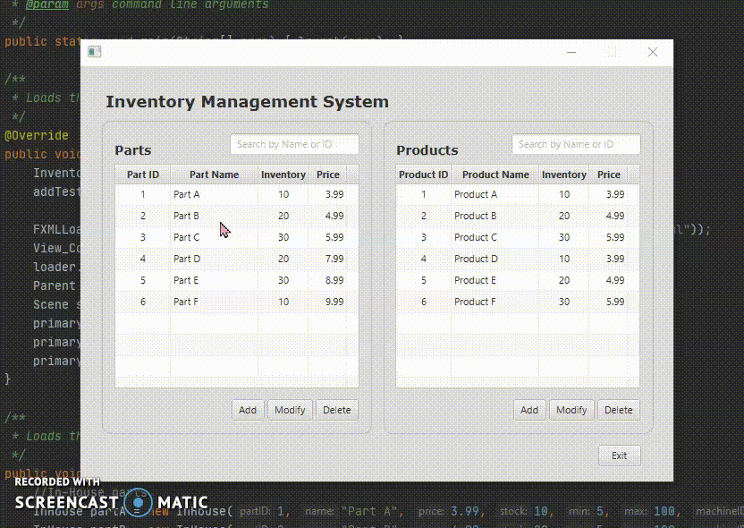

# InventoryManager
Java desktop program used to manage inventory parts and products.
  

  <kbd>
</img>
  </kbd>

<h2>Project Requirements</h2>
  <ul>
    <li>JavaFX User Interface must contain Main form, Add Part form, Modify Part form, Add Product form, and Modify Product form componenets.</li>
    <li>Create classes with data and logic that map to the UML class diagram and include the supplied Part class. Code should demonstrate inheritance, abstract and concrete classes, instance and static variables, and instance and static methods.</li>
  </ul>
  
Add the following functionalities to the Main form:
<u>The Parts pane</u>
  <ul>
    <li>The Add button under the Parts TableView opens the Add Part form.</li>
    <li>The Modify button under the Parts TableView opens the Modify Part form.</li>
    <li>The Delete button under the Parts TableView deletes the selected part from the Parts TableView or displays a descriptive error message in the UI or in a dialog box if a part is not deleted.</li>
    <li>When the user searches for parts by ID or name (partial or full name) using the text field, the application displays matching results in the Parts TableView. (Including a search button is optional.) If the part or parts are found, the application highlights a single part or filters multiple parts. If the part is not found, the application displays an error message in the UI or in a dialog box.</li>
    <li>If the search field is set to empty, the table should be repopulated with all available parts.</li>    
  </ul>
  

<h2>The Challenge</h2>
  
You are working for a small manufacturing organization that has outgrown its current inventory system. Members of the organization have been using a spreadsheet program to manually enter inventory additions, deletions, and other data from a paper-based system but would now like you to develop a more sophisticated inventory program.
  
You have been provided with a mock-up of the user interface to use in the design and development of the system and a class diagram to assist you in your work. The organization also has specific business requirements that must be considered for the application. A systems analyst created the solution statements outlined in the requirements section of this task based on the business requirements. You will use these solution statements to develop your application.
  

  

<h2>The Solution</h2>
<ul>
  </li></li>
</ul>

